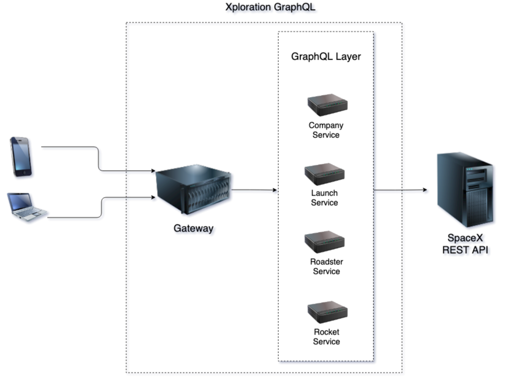

<div align="center">

<h1>Xploration GraphQL</h1>
</div>
A mono-repo federated GraphQL service that is a wrapper around the <a href="https://github.com/r-spacex/SpaceX-API">SpaceX REST API</a>.

### Architecture Diagram:
<div align="start">
<br />

<br />
</div>

### Features:
- Apollo Federated GraphQL 
- Typescript
- Apollo Tracing
- ESLint + Prettier
- Husky (for lint enforcement)

### Getting started:
1. Make sure you have [NodeJS](https://nodejs.org/) and [npm](https://www.npmjs.com/) installed locally.
2. Clone the repo:
```sh
$ git clone git@github.com:Kartikkumargujarati/xploration-graphql.git
```
3. Install dependencies:
```sh
$ cd xploration-graphql
$ npm install
```
4. Build and run the graphql server:
```sh
$ npm run build
$ npm run start:dev
```
5. Explore federated schema and make queries in the GraphQL Playground running at [localhost:6969](http://localhost:6969/)
